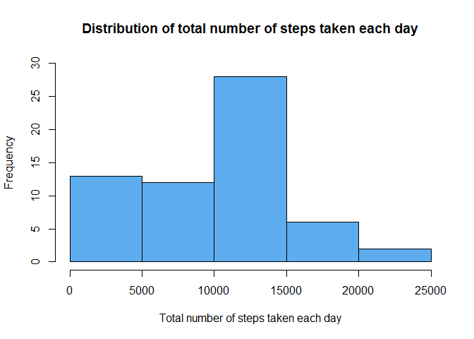
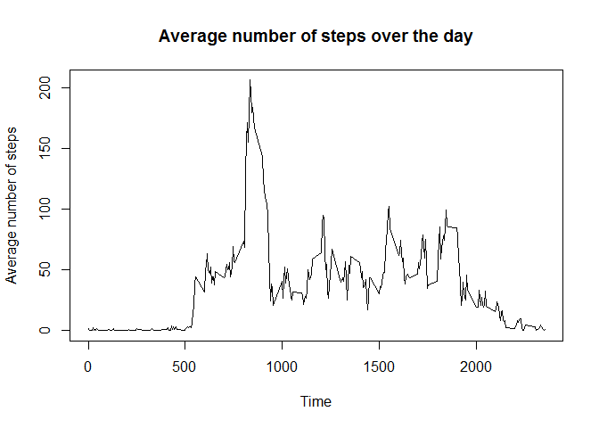
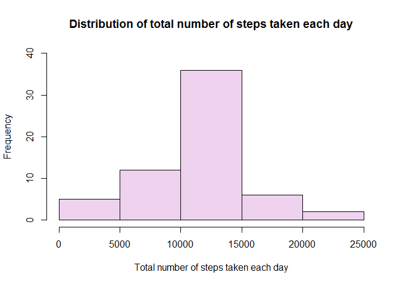
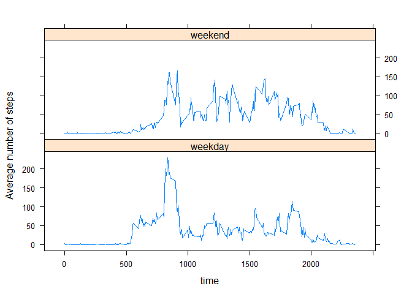

# Reproducible Research: Peer Assessment 1


```r
# Load required libraries
library(plyr)
library(lattice)
```

## Loading and preprocessing the data

```r
# Unpack the CSV if necessary
if (!file.exists("activity.csv")) {
  unzip("activity.zip")
}

# Load the CSV with appropriate types
data <- read.csv("activity.csv", header=T, sep=",", na.strings="NA", colClasses=c("integer", "Date", "integer"))
```

## What is mean total number of steps taken per day?

```r
# Use plyr to summarise steps by day
stepsPerDay <- ddply(data, ~date, summarise, steps=sum(steps, na.rm=TRUE))

# Calculate the mean and median steps per day
stepsMean <- mean(stepsPerDay$steps, na.rm=TRUE)
stepsMedian <- median(stepsPerDay$steps, na.rm=TRUE)

# Draw a histogram of the distribution of steps per day
hist(stepsPerDay$steps,
     main="Distribution of total number of steps taken each day",
     xlab="Total number of steps taken each day",
     col="steelblue2",
     ylim=c(0,30)
)
```

 
  
The mean number of steps per day is **9354.23** and the median number of steps per day is **10395**.

## What is the average daily activity pattern?

```r
# Use plyr to summarise the mean number of steps per 5 min interval
stepsPerInterval <- ddply(data, ~interval, summarise, steps=mean(steps, na.rm=TRUE))  

plot(stepsPerInterval,
     main="Average number of steps over the day",
     type="l",
     xlab="Time",
     ylab="Average number of steps"
) 
```

 

```r
# Calculate the largest interval in the summary
largestInterval <- stepsPerInterval$interval[stepsPerInterval$steps == max(stepsPerInterval$steps)]
```

We can see here that the majority of activity is first thing in the morning, presumably travelling to work.

On average across all days, the largest number of steps is recorded at **0835h**

## Imputing missing values

```r
# Count missing step values
numMissing <- sum(is.na(data$steps))
```

The number of missing step variables is **2304**  

Now impute NA values with the mean number of steps:

```r
# IMPUTING STRATEGY
# Use plyr to replace steps with NA values with the mean number of steps for any interval
dataNoNA <- ddply(data, 
                  ~interval, 
                  transform, 
                  steps = replace(steps, 
                                  is.na(steps), 
                                  round(mean(steps, na.rm=TRUE))
                  )
)
```

After imputing NA values, we can re-plot the above histogram:

```r
# Recalculate number of steps per day
stepsPerDayNoNA <- ddply(dataNoNA, ~date, summarise, steps=sum(steps, na.rm=TRUE))

# Recalculate mean and median steps per day
stepsMeanNoNA <- as.integer(mean(stepsPerDayNoNA$steps))
stepsMedianNoNA <- as.integer(median(stepsPerDayNoNA$steps))

# Draw a similar histogram to above
hist(stepsPerDayNoNA$steps,
     main="Distribution of total number of steps taken each day",
     xlab="Total number of steps taken each day",
     col="thistle2",
     ylim=c(0,40)
)
```

 

The mean number of steps per day, after imputing NA values with the average number of steps per interval is **10765** and the median is **10762**.

This is fairly close to the previous plot/calculation. Imputing NA values hasn't changed things considerably.

## Are there differences in activity patterns between weekdays and weekends?

```r
# Add a weekend/weekday factor column
dayType <- c()
for (idx in 1:nrow(dataNoNA)) {
  if (weekdays(dataNoNA[idx,]$date) == "Saturday" | 
      weekdays(dataNoNA[idx,]$date) == "Sunday"){
    dayType[idx] <- "weekend"
  } else {
    dayType[idx] <- "weekday"
  }
}

# Bind the column to the 'fixed' data set
dataNoNA <- cbind(dataNoNA, dayType)

# summarize by dayType and interval
stepsByDayType <- ddply(dataNoNA, ~ dayType + interval, summarise, steps = mean(steps, na.rm=TRUE))  

# Do a lattice plot
xyplot(steps ~ interval | dayType, 
       data = stepsByDayType, 
       type="l", 
       xlab= "time", 
       ylab="Average number of steps", 
       layout=c(1,2)
)
```

 

We see here that activity on weekends is spread throughout the day, whereas on weekdays the majority of the activity is first thing in the morning (possibly walking/commuting to work).
